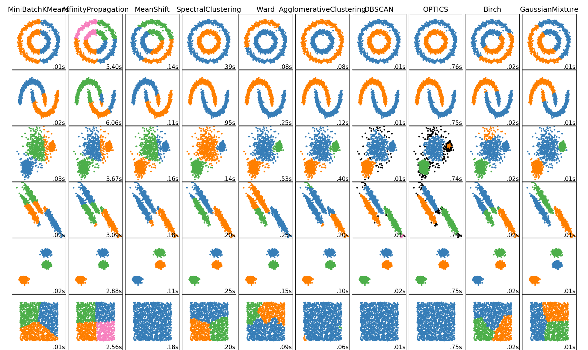

```{r setup, include=FALSE}
knitr::opts_chunk$set(echo = TRUE)
knitr::knit_engines$set(python = reticulate::eng_python)
```

En la IPS Universitaria - Servicios de Salud Universidad de Antioquia hay un excelente programa de atención domiciliaria para evitar los desplazamientos de personas en vulnerabilidad y adultos mayores que pueden ser atendidos con mayor comodidad y dignidad en sus casas mediante visitas médicas. 

En ocasiones, las direcciones de los hogares no se especifican bien y sucede que no pertenecen a la zona asignada por la persona encargada de programar las visitas; pero saber cuáles son estos casos corresponde a un trabajo manual que puede tomar muchas horas del valioso tiempo del personal hospitalario.

Por este motivo, quería compartirles un algoritmo de clusterización no supervisado (DBSCAN) que funciona extremadamente bien con formas geo-espaciales irregulares y tiene una característica altamente deseable para este caso: Detección de valores atípicos. 

Inicialmente había programado este script en `Python`, pero utilizaré `R` ya que los paquetes y funciones de visualización me parecen más amigables, mejor documentadas y más sencillas de utilizar en este caso particular. Igualmente, al final les dejaré el código si desean replicarlo en Python.

(Fuente : https://towardsdatascience.com)


Este script identifica clusters dadas dos variables, potencialmente espaciales, utilizando el algoritmo no supervizado DBSCAN (density-based clustering for discovering clusters in large datasets with noise), el cuál depende de:

- El parámetro eps define el radio de un vecindario alrededor de un punto X. Es denominado el \(\epsilon\)-vecindario of x. 

- El parámetro MinPts es el número mínimo de puntos alrededor del radio "eps".

Es necesario registrarse en la API de Google si deseas utiliza la función `get_googlemap`, más información en:  [Google Cloud API](https://developers.google.com/maps/documentation/maps-static/get-api-key)

```{r, message=F, warning = F}
library(tidyverse) #Transformación
library(fpc) #Para el BDSCAN
library(factoextra) #Gráficas de BDSCAN
library(ggmap) #Mapa
library(gridExtra) #Mapa


map <- get_googlemap("Medellin, Colombia", zoom = 13, maptype = "roadmap")
map_hybrid <- get_googlemap("Medellin, Colombia", zoom = 13, maptype = "hybrid")
# Georeferenciación - si es necesario 
# dir <- read_csv2("direcciones.csv")
# dir_coord <- mutate_geocode(dir, location = dir)
# dir_coord %>% 
#   write_csv2("direcciones_coord.csv")
```

## DBSCAN

El parámetro Epsilon se definió en 0.009. Se llegó a este valor identificando la distancia deseada entre los puntos en el cluster. Una manera sencilla de comprobarlo mediante tanteo es restando dos puntos que se sabe previamente que corresponden al cluster y adicionalmente están a la máxima distancia dentro del mismo. Sin embargo es importante resaltar que hay métodos más cientifícos para determinar Epsilon como gráficas de "Elbow" y métodos utilizados en algoritmos como k-Means.

```{r}
raw_domi <- read_csv2("Zona4.csv") %>%  
  select(longitud_x, latitud_y, id)
# Compute DBSCAN using fpc package

domi <- data.frame(raw_domi[,1:2])

ggmap(map) + 
  geom_point(data = domi, aes(x = longitud_x, y = latitud_y))

db <- fpc::dbscan(domi, eps = 0.009, MinPts = 7)
```

## Visualización de los resultados del algoritmo DBSCAN

Podemos construir una gráfica interactiva básica utilizando una combinación del paquete `plotly` con `ggplot2`. Básicamente elaboramos toda la gráfica en un lenguaje cómodo como ggplot2 y posteriormente `plotly` agrega la interactividad.

Adicionalmente cambiamos los resultados del algoritmo DBSCAN de 1 y 0 a "Detectado en la zona" y "No detectado en la zona" respectivamente.

```{r}
domi_final <- raw_domi %>% 
  mutate(cluster = as_factor(db$cluster)) %>% 
  mutate(cluster = case_when(
    db$cluster == 1 ~ "Detectado En la zona",
    db$cluster == 0 ~ "Detectado Fuera de la zona"
  ))

p <- ggmap(map) + geom_jitter(data = domi_final, aes(x = longitud_x, y = latitud_y, color = cluster), 
             alpha = 0.8,
             size = 2) +
  scale_color_brewer(palette = "Dark2") +
  labs(title = "Zona 4 (Medellín, Centro - Occidental)",
       subtitle = "Atención domiciliaria - Algoritmo DBSCAN \nDensity-based clustering for discovering clusters in large datasets with noise",
       color = "Cluster",
       x = "Longitud",
       y = "Latitud") 
  
plotly::ggplotly(p)
# Utilizar para guardar nuevamente la información
# final_domi %>% 
#   write_csv2("Zona4_final.csv")

#Para guardar la gráfica en una buena resolución
ggsave("zona4.pdf", units = "cm", height = 20, width = 16)
```

# Versión en Python

Este script no está terminado y simplemente es una referencia si deseas realizar una adaptación. Confío en que tiene muchas mejoras posibles y habrán mejores implementaciones dado que recientemente lo comencé a utilizar. :)
 
```{}
import numpy as np 
from sklearn.cluster import DBSCAN 
from sklearn.datasets.samples_generator import make_blobs 
from sklearn.preprocessing import StandardScaler 
import matplotlib.pyplot as plt 
import pandas as pd

raw_domiciliaria = pd.read_csv("map_data_domiciliaria.csv", sep = ";")

X_new = np.float64()

X_new = np.asanyarray([raw_domiciliaria["latitud_y"], raw_domiciliaria["longitud_x"]]).transpose()
epsilon = 0.009
minimumSamples = 7
db = DBSCAN(eps=epsilon, min_samples=minimumSamples).fit(X_new)
labels = db.labels_
labels

# =============================================================================
# Distinguish outliers
# Lets Replace all elements with 'True' in core_samples_mask that are in the cluster, 'False' if the points are outliers.
# =============================================================================

# First, create an array of booleans using the labels from db.
core_samples_mask = np.zeros_like(db.labels_, dtype=bool)
core_samples_mask[db.core_sample_indices_] = True
core_samples_mask

# Number of clusters in labels, ignoring noise if present.
n_clusters_ = len(set(labels)) - (1 if -1 in labels else 0)
n_clusters_

# Remove repetition in labels by turning it into a set.
unique_labels = set(labels)
unique_labels

# Create colors for the clusters.
colors = plt.cm.Spectral(np.linspace(0, 1, len(unique_labels)))

# Plot the points with colors
for k, col in zip(unique_labels, colors):
    if k == -1:
        # Black used for noise.
        col = 'k'

    class_member_mask = (labels == k)

    # Plot the datapoints that are clustered
    xy = X_new[class_member_mask & core_samples_mask]
    plt.scatter(xy[:, 0], xy[:, 1],s=50, c=[col], marker=u'o', alpha=0.5)

    # Plot the outliers
    xy = X_new[class_member_mask & ~core_samples_mask]
    plt.scatter(xy[:, 0], xy[:, 1],s=50, c=[col], marker=u'o', alpha=0.5)
```

